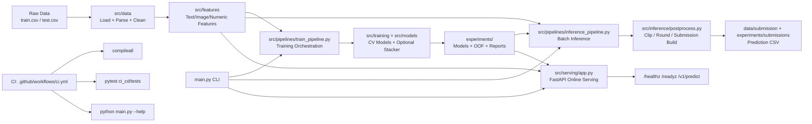

# A_ML_25 — Multimodal Price Prediction System

Production-oriented ML repository for product price prediction using text, image, and numeric signals.

This project contains:

- an end-to-end offline training pipeline,
- an inference pipeline and submission generation,
- a baseline online serving API,
- CI quality gates and developer onboarding assets.

## 1) Project Overview

The system predicts product price from multimodal inputs:

- text content (titles/descriptions),
- image representations,
- parsed numeric features (quantity/unit and derived signals).

Primary metric: SMAPE (lower is better).

## 2) Repository Structure

```text
main.py                        # CLI entrypoint (train/inference/features/ensemble/quickrun)
configs/                       # YAML configs for training, inference, models, and features
src/
    data/                        # Data loading, parsing, text cleaning
    features/                    # Text/image/numeric feature builders and reducers
    models/                      # Model wrappers (Linear/RF/LGBM/XGB/Cat/etc.)
    training/                    # CV utilities, trainer, metrics
    inference/                   # Predict and postprocess pipeline
    pipelines/                   # Train/infer/feature/ensemble orchestrators
    serving/                     # FastAPI serving baseline
ci_cd/tests/                   # CI test suite
docs/                          # SLO and handover docs
experiments/                   # Artifacts: models, oof, logs, reports, submissions
```

## 3) Core Architecture

### System architecture (image)

#### High level


#### Detailed Info Structure


### System structure (block diagram)

Detailed flow (Mermaid):



### Module mapping

- Data ingestion and normalization: `src/data/`
- Multimodal feature construction: `src/features/`
- Pipeline orchestration: `src/pipelines/`
- Model training and ensembling: `src/training/`, `src/models/`
- Offline inference and output formatting: `src/inference/`
- Online API serving: `src/serving/app.py`
- Entry-point command interface: `main.py`
- Quality gates and regression checks: `ci_cd/tests/`, `.github/workflows/ci.yml`

### Offline path (training)

1. Load dataset
2. Parse/clean features
3. Build multimodal feature matrix
4. Optional dimensionality reduction
5. CV training for base models
6. Build OOF matrix and optional stacker
7. Persist artifacts and reports

### Offline path (batch inference)

1. Load inference CSV
2. Rebuild features with saved/cached transforms
3. Load fold models + stacker
4. Predict + postprocess
5. Write output CSV

### Online path (serving baseline)

FastAPI service in `src/serving/app.py`:

- `GET /healthz`
- `GET /readyz`
- `POST /v1/warmup`
- `POST /v1/predict`

## 4) Environment Setup

### Prerequisites

- Python 3.10+
- pip

### Install

```bash
python -m pip install --upgrade pip
pip install -r requirements.txt
```

### Verify

```bash
python -m compileall src main.py
pytest -q ci_cd/tests
python main.py --help
```

## 5) How to Run

### Train

```bash
python main.py train --config configs/training/final_train.yaml
```

Train single model only:

```bash
python main.py train --config configs/training/final_train.yaml --model lgbm
```

### Build features only

```bash
python main.py features --config configs/features/all_features.yaml
```

### Offline inference

```bash
python main.py inference --config configs/inference/inference.yaml
```

### Ensemble-only pipeline

```bash
python main.py ensemble --config configs/model/ensemble.yaml
```

### Quick experiment run

```bash
python main.py quickrun
```

## 6) Serving (Local)

Create local env file first:

```bash
cp .env.example .env
```

On Windows PowerShell:

```powershell
Copy-Item .env.example .env
```

Important: if `TEXT_METHOD=tfidf`, `TFIDF_VECTORIZER_PATH` must point to a fitted vectorizer artifact from training.

Start API:

```bash
uvicorn src.serving.app:app --host 0.0.0.0 --port 8000
```

Health and readiness:

```bash
curl http://127.0.0.1:8000/healthz
curl http://127.0.0.1:8000/readyz
```

Prediction example:

```bash
curl -X POST "http://127.0.0.1:8000/v1/predict" \
    -H "Content-Type: application/json" \
    -d '{
                "records": [
                    {"unique_identifier": 1, "Description": "Organic green tea 20 bags", "image_path": ""}
                ]
            }'
```

## 7) Artifacts and Outputs

Typical generated artifacts:

- `experiments/models/` (fold models, stacker)
- `experiments/oof/` (OOF matrix, model names)
- `experiments/reports/` (comparison and stacker summaries)
- `experiments/submissions/` (prediction files)

## 8) CI and Quality Gates

GitHub Actions workflow in `.github/workflows/ci.yml` runs:

1. dependency installation,
2. syntax gate (`compileall`),
3. test gate (`pytest -q ci_cd/tests`),
4. CLI smoke gate (`python main.py --help`).

## 9) Data and Experiment Configs

Use YAML configs under `configs/`:

- `configs/training/` for training runs and CV behavior,
- `configs/inference/` for inference inputs/outputs,
- `configs/model/` for model-specific hyperparameters,
- `configs/features/` for feature settings.

The CLI automatically supports nested config sections (for example, `training:` and `inference:` blocks).

## 10) Operational Notes

- Designed as a modular ML codebase with production hardening underway.
- Current serving stack is FastAPI baseline; low-latency production design should evolve with Redis-backed online feature lookup, Kafka event-driven updates, Docker/Kubernetes orchestration, and stronger monitoring/rollback automation.

### Target improvement roadmap (future plan)

To move from challenge-grade ML workflows to production-grade, hyper-scalable architecture, the planned target includes:

1. **Feature Store integration (Feast/Hopsworks)** for online/offline parity and point-in-time correctness.
2. **Distributed training + Bayesian HPO** (`Ray`/`Kubeflow` + `Optuna`/`Ray Tune`) for stronger model search quality.
3. **Asynchronous inference architecture** (`Redis`/`RabbitMQ`/`Kafka`) with `task_id`-based queue + worker execution.
4. **Model registry lifecycle controls** (`MLflow`/`W&B`) with Champion/Challenger promotion flow.
5. **Drift detection and observability automation** (`Evidently`/`Arize` + metrics/alerts) with retraining triggers.

Current vs target trend:
- Data logic: local CSV pipelines -> distributed ETL.
- Feature management: script-level features -> governed online/offline feature store.
- Inference: synchronous REST -> async queue workers + model serving layer.
- Experimentation: local artifacts -> tracked registry lifecycle.
- Scaling: vertical scaling -> horizontal autoscaling on Kubernetes.

See:

- `docs/DEVELOPER_ONBOARDING_AND_TECHNICAL_HANDOVER.md`
- `docs/slo_latency_tiers.md`

Detailed execution roadmap: `docs/DEVELOPER_ONBOARDING_AND_TECHNICAL_HANDOVER.md` section "10) Target Future Development Plan (Gap Closure Roadmap)".

## 11) Experiment Tracking (MLflow and DagsHub)

Training and inference runs are tracked through `src/utils/mlflow_utils.py`.

### Local MLflow tracking

1. Start local MLflow server:

```powershell
./scripts/start_mlflow_server.ps1 -Port 5000
```

1. Set tracking env vars:

```powershell
$env:MLFLOW_ENABLED='1'
$env:MLFLOW_TRACKING_URI='http://127.0.0.1:5000'
```

1. Run training experiment:

```powershell
$env:PYTHONPATH='.'
python main.py train --config configs/training/final_train.yaml
```

### DagsHub-backed tracking

Use environment variables for credentials. Do not hardcode tokens in YAML.

```powershell
$env:MLFLOW_ENABLED='1'
$env:DAGSHUB_MLFLOW_ENABLED='1'
$env:DAGSHUB_REPO_OWNER='<your_dagshub_username_or_org>'
$env:DAGSHUB_REPO_NAME='A_ML_25'
$env:DAGSHUB_TOKEN='<your_dagshub_access_token>'
```

Then run:

```powershell
$env:PYTHONPATH='.'
python main.py train --config configs/training/final_train.yaml
```

Expected outputs after run:

- MLflow run metadata in the generated manifest under `outputs.mlflow`.
- Registry linkage in `experiments/registry/index.json` under `tracking.mlflow`.
- Run visible in DagsHub experiment UI when DagsHub mode is enabled.

## 12) Contribution Workflow

1. Create focused changes in one subsystem.
2. Add/update tests under `ci_cd/tests` for behavior changes.
3. Run local quality checks before PR.
4. Keep config and artifact paths consistent with existing conventions.

## 13) License and Usage

This repository is intended for ML challenge work and production-learning workflows.
Ensure model/data usage follows challenge rules and organizational policy.

## 14) DVC + Git Best Practices (Implemented)

This repository follows a strict split:

- Git tracks: code, configs, docs, CI, and `.dvc` pointer metadata.
- DVC tracks: large datasets, feature caches, model artifacts, and generated experiment payloads.

### Daily workflow

1. Pull code and data pointers:

```bash
git pull
dvc pull
```

1. Run training/inference and update artifacts.

1. Track changed payloads with DVC:

```bash
dvc add data/raw/train.csv data/raw/test.csv
dvc add data/processed/dimred.joblib data/processed/features.joblib
dvc add experiments/oof/oof_matrix.joblib experiments/reports/model_comparison.csv
```

1. Commit pointers and related code/config together:

```bash
git add .
git commit -m "feat: update model and DVC pointers"
```

1. Push data cache then code:

```bash
dvc push
git push
```

If you keep DagsHub credentials in `.env`, use the helper script so DVC commands automatically pick them up:

```powershell
./scripts/dvc_with_env.ps1 push -r origin --all-commits
./scripts/dvc_with_env.ps1 pull -r origin
```

### Enforced guardrails

- `.gitignore` blocks large payload directories while allowing `.dvc` files.
- CI runs `python scripts/check_repo_hygiene.py` to fail PRs if binary payloads are committed directly to Git.
- If `dvc push` fails due credentials, data pointers may be in Git but remote data will not be available to collaborators until push succeeds.
