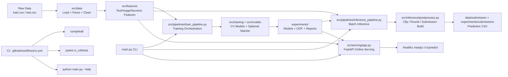

# A_ML_25 - Multimodal Price Prediction System

Production-oriented ML repository for product price prediction using text, image, and numeric signals.

This project contains:

- an end-to-end offline training pipeline,
- an inference pipeline and submission generation,
- a bundle-backed online serving API,
- a registry, promotion, and deployment state layer,
- a live Hugging Face Space deployment path,
- CI quality gates and developer onboarding assets.

## 1) Project Overview

The system predicts product price from multimodal inputs:

- text content (titles/descriptions),
- image representations,
- parsed numeric features (quantity/unit and derived signals).

Primary metric: SMAPE (lower is better).

## 2) Repository Structure

```text
main.py                        # CLI entrypoint (train/inference/features/ensemble/quickrun)
configs/                       # YAML configs for training, inference, models, and features
src/
    data/                        # Data loading, parsing, text cleaning
    features/                    # Text/image/numeric feature builders and reducers
    models/                      # Model wrappers (Linear/RF/LGBM/XGB/Cat/etc.)
    training/                    # CV utilities, trainer, metrics
    inference/                   # Predict and postprocess pipeline
    pipelines/                   # Train/infer/feature/ensemble orchestrators
    serving/                     # FastAPI serving and live service validation
ci_cd/tests/                   # CI test suite
docs/                          # Handover, setup, and workflow docs
experiments/                   # Artifacts: bundles, registry state, reports, submissions
```

## 3) Core Architecture

### System architecture (image)

#### High level


#### Detailed Info Structure


### System structure (block diagram)

Detailed flow (Mermaid):



### Module mapping

- Data ingestion and normalization: `src/data/`
- Multimodal feature construction: `src/features/`
- Pipeline orchestration: `src/pipelines/`
- Model training and ensembling: `src/training/`, `src/models/`
- Offline inference and output formatting: `src/inference/`
- Online API serving: `src/serving/app.py`
- Entry-point command interface: `main.py`
- Quality gates and regression checks: `ci_cd/tests/`, `.github/workflows/ci.yml`

### Offline path (training)

1. Load dataset
2. Parse/clean features
3. Build multimodal feature matrix
4. Optional dimensionality reduction
5. CV training for base models
6. Build OOF matrix and optional stacker
7. Persist artifacts and reports

### Offline path (batch inference)

1. Load inference CSV
2. Rebuild features with saved/cached transforms
3. Load fold models + stacker
4. Predict + postprocess
5. Write output CSV

### Online path (serving)

FastAPI service in `src/serving/app.py`:

- `GET /healthz`
- `GET /readyz`
- `GET /service/info`
- `GET /metrics/json`
- `POST /v1/warmup`
- `POST /v1/predict`

## 4) Environment Setup

### Prerequisites

- Python 3.10+
- pip

### Install

```bash
python -m pip install --upgrade pip
pip install -r requirements.txt
```

### Verify

```bash
python -m compileall src main.py
pytest -q ci_cd/tests
python main.py --help
```

## 5) How to Run

### Train

```bash
python main.py train --config configs/training/final_train.yaml
```

Train single model only:

```bash
python main.py train --config configs/training/final_train.yaml --model lgbm
```

### Build features only

```bash
python main.py features --config configs/features/all_features.yaml
```

### Offline inference

```bash
python main.py inference --config configs/inference/inference.yaml
```

### Ensemble-only pipeline

```bash
python main.py ensemble --config configs/model/ensemble.yaml
```

### Quick experiment run

```bash
python main.py quickrun
```

## 6) Serving (Local)

Create local env file first:

```bash
cp .env.example .env
```

On Windows PowerShell:

```powershell
Copy-Item .env.example .env
```

Important: if `TEXT_METHOD=tfidf`, `TFIDF_VECTORIZER_PATH` must point to a fitted vectorizer artifact from training.

Start API:

```bash
uvicorn src.serving.app:app --host 0.0.0.0 --port 8000
```

Health and readiness:

```bash
curl http://127.0.0.1:8000/healthz
curl http://127.0.0.1:8000/readyz
```

Prediction example:

```bash
curl -X POST "http://127.0.0.1:8000/v1/predict" \
    -H "Content-Type: application/json" \
    -d '{
                "records": [
                    {"unique_identifier": 1, "Description": "Organic green tea 20 bags", "image_path": ""}
                ]
            }'
```

## 7) Artifacts, Registry, and Deployment State

Typical generated artifacts:

- `experiments/runs/<run_id>/bundle/` (immutable run-scoped model bundle)
- `experiments/registry/index.json` (registry state and active production pointer)
- `experiments/registry/deployment_manifest.json` (verified deployment record)
- `experiments/registry/production_tracker.json` (active production metadata and metrics)
- `experiments/oof/` (OOF matrix, model names)
- `experiments/reports/` (comparison and stacker summaries)
- `experiments/submissions/` (prediction files)

Current checked-in production state points to:

- active production run: `train_20260325T155219Z`
- strategy: `hf_space`
- status: `active`
- deployment URL: `https://arpitkumariitkgp-aml25.hf.space`

## 8) CI and Quality Gates

GitHub Actions workflow in `.github/workflows/ci.yml` runs:

1. dependency installation,
2. syntax gate (`compileall`),
3. test gate (`pytest -q ci_cd/tests`),
4. CLI smoke gate (`python main.py --help`).

## 9) Data and Experiment Configs

Use YAML configs under `configs/`:

- `configs/training/` for training runs and CV behavior,
- `configs/inference/` for inference inputs/outputs,
- `configs/model/` for model-specific hyperparameters,
- `configs/features/` for feature settings.

The CLI automatically supports nested config sections (for example, `training:` and `inference:` blocks).

## 10) Operational Notes

- Designed as a modular ML codebase with a real production-like release path.
- Current serving stack is FastAPI with bundle-backed loading, registry-aware deployment state, and a Hugging Face Space deployment target.
- The most credible current portfolio story is: train a run-scoped bundle, promote the run, deploy it to Hugging Face Space, verify live endpoints, then persist production state.

### Target improvement roadmap (future plan)

To move from challenge-grade ML workflows to production-grade, hyper-scalable architecture, the planned target includes:

1. **Feature Store integration (Feast/Hopsworks)** for online/offline parity and point-in-time correctness.
2. **Distributed training + Bayesian HPO** (`Ray`/`Kubeflow` + `Optuna`/`Ray Tune`) for stronger model search quality.
3. **Asynchronous inference architecture** (`Redis`/`RabbitMQ`/`Kafka`) with `task_id`-based queue + worker execution.
4. **Model registry lifecycle controls** (`MLflow`/`W&B`) with Champion/Challenger promotion flow.
5. **Drift detection and observability automation** (`Evidently`/`Arize` + metrics/alerts) with retraining triggers.

Current vs target trend:
- Data logic: local CSV pipelines -> distributed ETL.
- Feature management: script-level features -> governed online/offline feature store.
- Inference: synchronous REST -> async queue workers + model serving layer.
- Experimentation: local artifacts -> tracked registry lifecycle.
- Scaling: vertical scaling -> horizontal autoscaling on Kubernetes.

See:

- `docs/DEVELOPER_ONBOARDING_AND_TECHNICAL_HANDOVER.md`
- `docs/GITHUB_SECRETS_SETUP.md`
- `docs/KAGGLE_COLAB_DVC_MLFLOW_GITHUB_RUNBOOK.md`

Detailed execution roadmap: `docs/DEVELOPER_ONBOARDING_AND_TECHNICAL_HANDOVER.md` section "10) Target Future Development Plan (Gap Closure Roadmap)".

## 11) Experiment Tracking (MLflow and DagsHub)

Training and inference runs are tracked through `src/utils/mlflow_utils.py`.

### Local MLflow tracking

1. Start local MLflow server:

```powershell
./scripts/start_mlflow_server.ps1 -Port 5000
```

1. Set tracking env vars:

```powershell
$env:MLFLOW_ENABLED='1'
$env:MLFLOW_TRACKING_URI='http://127.0.0.1:5000'
```

1. Run training experiment:

```powershell
$env:PYTHONPATH='.'
python main.py train --config configs/training/final_train.yaml
```

### DagsHub-backed tracking

Use environment variables for credentials. Do not hardcode tokens in YAML.

```powershell
$env:MLFLOW_ENABLED='1'
$env:DAGSHUB_MLFLOW_ENABLED='1'
$env:DAGSHUB_REPO_OWNER='<your_dagshub_username_or_org>'
$env:DAGSHUB_REPO_NAME='A_ML_25'
$env:DAGSHUB_TOKEN='<your_dagshub_access_token>'
```

Then run:

```powershell
$env:PYTHONPATH='.'
python main.py train --config configs/training/final_train.yaml
```

Expected outputs after run:

- MLflow run metadata in the generated manifest under `outputs.mlflow`.
- Registry linkage in `experiments/registry/index.json` under `tracking.mlflow`.
- Run visible in DagsHub experiment UI when DagsHub mode is enabled.

## 12) Contribution Workflow

1. Create focused changes in one subsystem.
2. Add/update tests under `ci_cd/tests` for behavior changes.
3. Run local quality checks before PR.
4. Keep config and artifact paths consistent with existing conventions.

## 13) License and Usage

This repository is intended for ML challenge work and production-learning workflows.
Ensure model/data usage follows challenge rules and organizational policy.

## 14) DVC + Git Best Practices (Implemented)

This repository follows a strict split:

- Git tracks: code, configs, docs, CI, and `.dvc` pointer metadata.
- DVC tracks: large datasets, feature caches, model artifacts, and generated experiment payloads.

### Daily workflow

1. Pull code and data pointers:

```bash
git pull
dvc pull
```

1. Run training/inference and update artifacts.

1. Track changed payloads with DVC:

```bash
dvc add data/raw/train.csv data/raw/test.csv
dvc add data/processed/dimred.joblib data/processed/features.joblib
dvc add experiments/oof/oof_matrix.joblib experiments/reports/model_comparison.csv
```

1. Commit pointers and related code/config together:

```bash
git add .
git commit -m "feat: update model and DVC pointers"
```

1. Push data cache then code:

```bash
dvc push
git push
```

If you keep DagsHub credentials in `.env`, use the helper script so DVC commands automatically pick them up:

```powershell
./scripts/dvc_with_env.ps1 push -r origin --all-commits
./scripts/dvc_with_env.ps1 pull -r origin
```

### Enforced guardrails

- `.gitignore` blocks large payload directories while allowing `.dvc` files.
- CI runs `python scripts/check_repo_hygiene.py` to fail PRs if binary payloads are committed directly to Git.
- If `dvc push` fails due credentials, data pointers may be in Git but remote data will not be available to collaborators until push succeeds.

## 15) CI/CD Automation

Production-oriented ML delivery pipeline with training, promotion, verified deployment, and health monitoring.

### Overview

Phase 3 automates the current portfolio deployment lifecycle:

```text
Git Push -> CI Gate -> Drift Check -> Training -> Promotion Approval -> HF Space Deploy -> Live Validation -> Production State Update
```

### Key Components

#### 1. Training Pipeline (`.github/workflows/training.yml`)
- Trigger: daily at `22:00 UTC` or manual `workflow_dispatch`
- Flow:
  1. check data drift
  2. pull data through DVC
  3. prepare training data
  4. train and validate a canonical bundle-backed run
  5. register the run in `experiments/registry/`
  6. persist workflow outputs and smoke-test artifacts
- Main output: canonical local `run_id`, immutable bundle, registry entry, metrics artifacts

#### 2. Promotion Workflow (`.github/workflows/promote.yml`)
- Supported stages: `staging` and `production`
- Flow:
  1. resolve canonical run ID
  2. restore durable bundle
  3. validate promotion thresholds
  4. require environment approval for production
  5. update registry state and tag approved releases
- Important distinction: promotion means approved for deployment, not yet live

#### 3. Deployment Workflow (`.github/workflows/deploy.yml`)
- Deployment target: Hugging Face Space
- Flow:
  1. resolve canonical run ID
  2. restore immutable bundle
  3. run pre-deployment checks
  4. run bundle-backed inference smoke test
  5. create HF Space package
  6. publish to Hugging Face Space
  7. wait for `/readyz` and `/service/info` to report the expected run
  8. run live prediction smoke test
  9. write `deployment_manifest.json`
  10. activate the production run in the registry
  11. write `production_tracker.json`
  12. persist verified deployment state back to Git

#### 4. Health Check Workflow (`.github/workflows/health-check.yml`)
- Frequency: every 6 hours or manual trigger
- Checks:
  - MLflow connectivity when configured
  - production model loadability
  - registry consistency
  - inference health
  - live production validation when service URL is available
- Uses the active production run and can derive the HF Space URL from workflow variables

#### 5. Daily Monitoring Workflow (`.github/workflows/daily-monitoring.yml`)
- Builds monitoring artifacts and checks alert conditions on a schedule

### Configuration

#### GitHub Secrets and Variables
Set these in `Settings -> Secrets and variables -> Actions`:

```text
MLFLOW_TRACKING_URI
MLFLOW_TRACKING_USERNAME
MLFLOW_TRACKING_PASSWORD
DAGSHUB_USERNAME
DAGSHUB_TOKEN
AWS_ACCESS_KEY_ID
AWS_SECRET_ACCESS_KEY
HF_SPACE_TOKEN
PRODUCTION_SERVICE_BASE_URL   # optional
HF_SPACE_REPO_ID              # variable, optional if using the default repo id
```

See `docs/GITHUB_SECRETS_SETUP.md` for setup guidance.

#### Model Registry
Located at `experiments/registry/`:

```text
index.json                 # run registry and active production pointer
promotion_history.jsonl    # promotion audit log
deployment_manifest.json   # verified deployment record
production_tracker.json    # active production metadata + metrics
```

### Quick Start

#### 1. Trigger Training
```bash
gh workflow run training.yml -f force_retrain=true -f model_config=configs/training/final_train.yaml
```

#### 2. Promote a Run
Open `Actions -> Model Promotion -> Run workflow`:
- enter the canonical `run_id`
- choose `staging` or `production`
- review promotion validation artifacts in the workflow logs

#### 3. Deploy to Hugging Face Space
Open `Actions -> Deploy Live Service -> Run workflow`:
- enter the approved `run_id`
- enter `space_repo_id` such as `arpitkumariitkgp/aml25`
- set `create_if_missing=true` only when bootstrapping a new Space

#### 4. Monitor Health
Health checks run automatically every 6 hours. Use `health-check.yml` for manual checks and `daily-monitoring.yml` for scheduled monitoring artifacts.

### Workflow Diagram

```text
Push/PR -> ci.yml
Schedule/manual -> training.yml -> staging registry entry
Manual approval -> promote.yml -> production-approved run
Manual deploy -> deploy.yml -> HF Space publish -> live verification -> deployment manifest + production tracker update
Scheduled/manual -> health-check.yml -> production validation
Scheduled -> daily-monitoring.yml -> monitoring artifacts and alerts
```

### Rollback Procedures

Manual rollback:

```bash
python scripts/rollback_deployment.py \
  --to-previous-production \
  --reason "Manual: detected latency spike"
```

Operationally, rollback uses the previous production run recorded in the deployment state and updates registry-tracked production metadata.

### Observability and Alerting

Key metrics to monitor:
- SMAPE or quality trend from training and promotion checks
- prediction latency (`p50`, `p95`, `p99`)
- error rate / exception rate
- data drift magnitude
- model freshness
- deployment success rate

Representative alert thresholds:

```text
WARN if latency_p95 > 2.0s | CRITICAL if > 5.0s
WARN if error_rate > 0.02  | CRITICAL if > 0.05
WARN if drift > 0.10       | CRITICAL if > 0.25
```

### Documentation

- `docs/DEVELOPER_ONBOARDING_AND_TECHNICAL_HANDOVER.md`
- `docs/GITHUB_SECRETS_SETUP.md`
- `docs/KAGGLE_COLAB_DVC_MLFLOW_GITHUB_RUNBOOK.md`

### Common Tasks

#### Force Retrain
```bash
gh workflow run training.yml -f force_retrain=true -f model_config=configs/training/final_train.yaml
```

#### Check Registry State
```bash
cat experiments/registry/index.json | jq '.'
```

#### View Promotion History
```bash
cat experiments/registry/promotion_history.jsonl | jq '.'
```

#### Manual Health Check
```bash
python scripts/health_check.py \
  --check-mlflow \
  --check-production-model \
  --check-registry \
  --check-inference \
  --output /tmp/health.json
```
