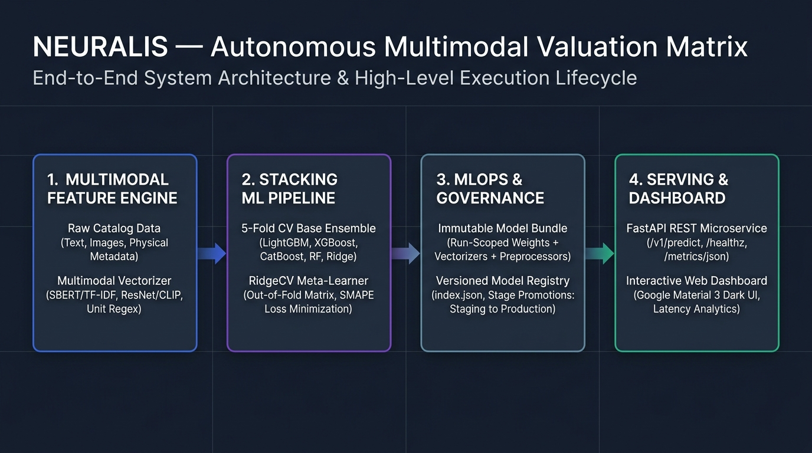
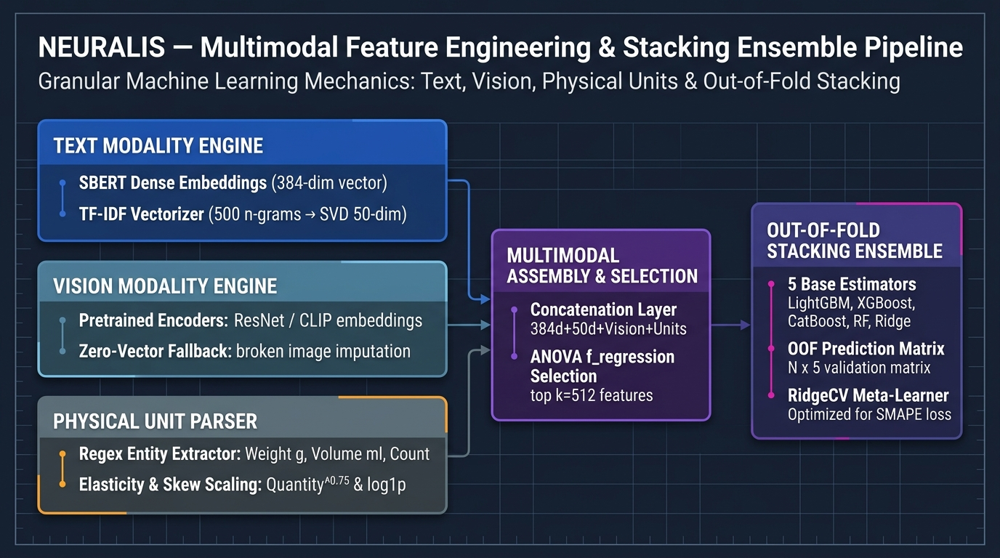
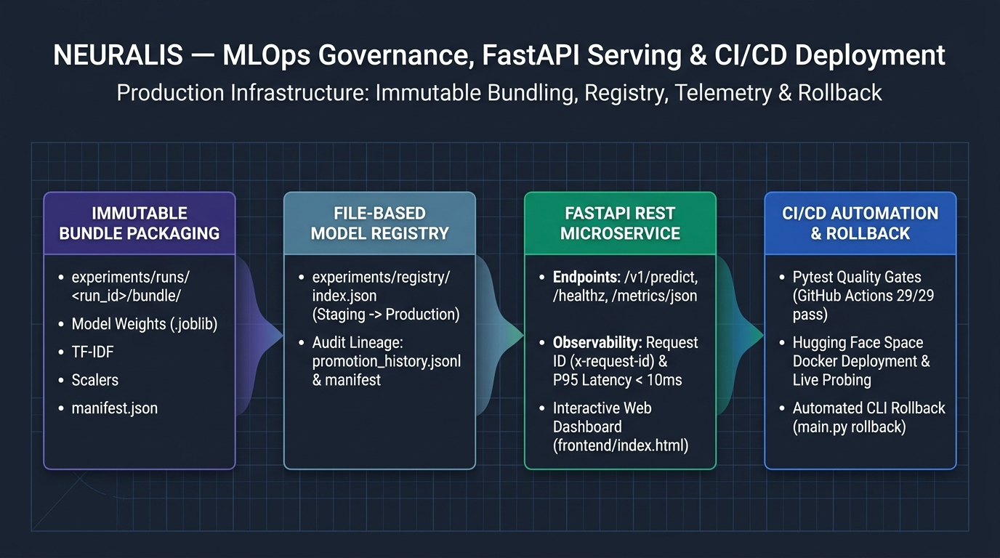
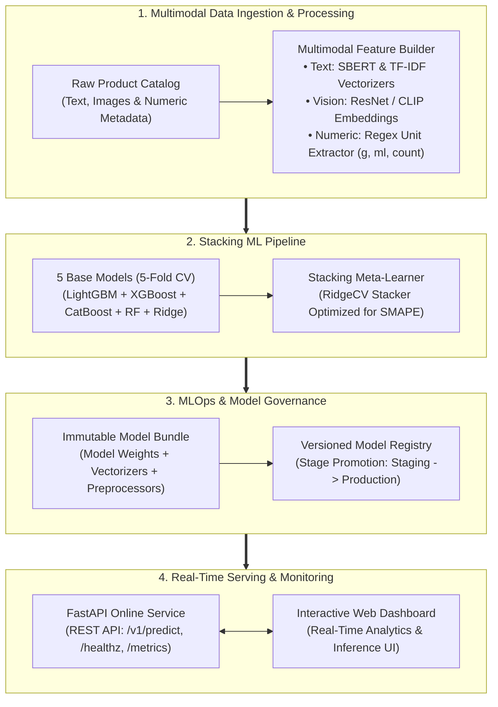

# NEURALIS — Autonomous Multimodal Valuation Matrix

[](https://www.python.org/)
[](https://fastapi.tiangolo.com/)
[](https://mlflow.org/)
[](https://dvc.org/)
[](LICENSE)
[](https://arpitkumariitkgp-aml25.hf.space)

> Deciphering market value at the intersection of vision, NLP, and ensemble intelligence.

Built to bridge the gap between notebook experimentation and real-world deployment, **NEURALIS** provides a complete end-to-end ML lifecycle: offline training pipelines, out-of-fold stacking ensembles, immutable model bundle packaging, a versioned model registry, a FastAPI online serving microservice, an interactive Web Dashboard, automated CI/CD quality gates, and automated deployment to Hugging Face Spaces with zero-downtime health verification and rollback support.

---

## Table of Contents

- [Key Features](#key-features)
- [System Architecture](#system-architecture)
- [Repository Structure](#repository-structure)
- [Data Pipeline & Schema Aliasing](#data-pipeline--schema-aliasing)
- [Multimodal Feature Engineering](#multimodal-feature-engineering)
- [Environment Setup & Quick Start](#environment-setup--quick-start)
- [CLI Reference & Workflows](#cli-reference--workflows)
- [Online Serving API & Web Dashboard](#online-serving-api--web-dashboard)
- [Model Registry, Bundles & Governance](#model-registry-bundles--governance)
- [Experiment Tracking & Data Versioning](#experiment-tracking--data-versioning)
- [CI/CD & MLOps Workflows](#cicd--mlops-workflows)
- [Centralized Documentation Hub](#centralized-documentation-hub)
- [Contributing & Hygiene](#contributing--hygiene)
- [License](#license)

---

## Key Features

- **Multimodal Feature Extraction**: Combines text representations (TF-IDF & Sentence-Transformers SBERT), visual image representations (ResNet / CLIP embeddings), and domain-specific parsed numeric signals (regex extraction for weights, volumes, counts, and log transforms).
- **Ensemble Modeling Pipeline**: Trains baseline & gradient-boosted models (LightGBM, XGBoost, CatBoost, Random Forest, Ridge) with cross-validation OOF generation and out-of-fold stacking. Primary optimization metric: **SMAPE** (Symmetric Mean Absolute Percentage Error).
- **Immutable Model Bundling**: Encapsulates model weights, feature transformers, schema rules, and preprocessing logic into run-scoped immutable bundles (`experiments/runs/<run_id>/bundle`) for 100% reproducible offline and online inference.
- **Version-Controlled Model Registry**: Lightweight JSON-based registry (`experiments/registry/`) managing active production pointers, promotion stages (`staging` / `production`), and deployment manifests.
- **FastAPI Microservice & Web UI**: Real-time REST endpoints (`/v1/predict`, `/healthz`, `/readyz`, `/metrics/json`, `/service/info`) with input schema validation, request metrics, fallback handling, and an interactive Web Dashboard (`frontend/index.html`).
- **Production CI/CD Automation**: GitHub Actions for code hygiene, automated retrain triggers, model promotion approval gates, Hugging Face Space deployment, live probe verification, and automated rollback scripts.
- **Dual Tracking & Data Versioning**: Integrated MLflow tracking (local & DagsHub remote) paired with DVC for versioning raw datasets and heavy model payloads.

---

## System Architecture & Pipeline Suite

### 1. High-Level System Architecture 



### 2. Multimodal Feature Engineering & Stacking ML Pipeline



### 3. MLOps Governance, FastAPI Serving & CI/CD Deployment



### End-to-End Data & Execution Flow 


```mermaid
flowchart TD
    %% Stage 1: Data & Feature Engineering
    subgraph S1 ["1. Multimodal Data Ingestion & Processing"]
        direction LR
        RAW["Raw Product Catalog\n(Text, Images & Numeric Metadata)"]
        PARSER["Multimodal Feature Builder\n• Text: SBERT & TF-IDF Vectorizers\n• Vision: ResNet / CLIP Embeddings\n• Numeric: Regex Unit Extractor (g, ml, count)"]
        RAW --> PARSER
    end

    %% Stage 2: Stacking Ensemble Training
    subgraph S2 ["2. Stacking ML Pipeline"]
        direction LR
        BASE["5 Base Models (5-Fold CV)\n(LightGBM + XGBoost + CatBoost + RF + Ridge)"]
        STACKER["Stacking Meta-Learner\n(RidgeCV Stacker Optimized for SMAPE)"]
        BASE --> STACKER
    end

    %% Stage 3: Packaging & Governance
    subgraph S3 ["3. MLOps & Model Governance"]
        direction LR
        BUNDLE["Immutable Model Bundle\n(Model Weights + Vectorizers + Preprocessors)"]
        REGISTRY["Versioned Model Registry\n(Stage Promotion: Staging -> Production)"]
        BUNDLE --> REGISTRY
    end

    %% Stage 4: Serving & Operations
    subgraph S4 ["4. Real-Time Serving & Monitoring"]
        direction LR
        API["FastAPI Online Service\n(REST API: /v1/predict, /healthz, /metrics)"]
        UI["Interactive Web Dashboard\n(Real-Time Analytics & Inference UI)"]
        API <--> UI
    end

    %% Pipeline Execution Connections
    S1 ==> S2
    S2 ==> S3
    S3 ==> S4
```

---

## Repository Structure

```text
NEURALIS/
├── main.py                        # Central CLI entrypoint (train, inference, features, ensemble, promote, etc.)
├── configs/                       # Production YAML configurations
│   ├── training/                  # Cross-validation & trainer configs
│   ├── inference/                 # Batch inference pipeline configs
│   ├── model/                     # Hyperparameter specs for LGBM, XGB, CatBoost, RF, Ridge
│   ├── features/                  # Multimodal feature settings & dimension reducers
│   ├── monitoring/                # Data drift & latency thresholds
│   └── validation/                # Deployment SLO rules
├── src/                           # Core source codebase
│   ├── data/                      # Data loaders, schema normalizers, unit & text parsers
│   ├── features/                  # TF-IDF/SBERT, image embeddings, numeric scalers, dim reduction
│   ├── models/                    # Model wrappers & stacking ensembler
│   ├── training/                  # CV utilities, loss metrics (SMAPE), trainer engine
│   ├── inference/                 # Offline prediction runtime & postprocessing
│   ├── pipelines/                 # End-to-end train, infer, feature & ensemble pipelines
│   ├── registry/                  # Local model registry state store & metadata managers
│   ├── serving/                   # FastAPI application, prediction endpoints & latency middleware
│   ├── monitoring/                # Batch quality checks, drift calculation & alert monitors
│   ├── validation/                # Pre-deploy checks & deployment SLO validation
│   └── utils/                     # Bundle IO, MLflow logging, alias helpers, live probes
├── frontend/                      # Web Monitoring & Inference Dashboard
│   ├── index.html                 # Interactive dashboard UI
│   ├── dashboard.js               # Dynamic API client & charting logic
│   └── dashboard.css              # Dark-mode responsive styling
├── ci_cd/tests/                   # Pytest automated test suite
├── docker/                        # Dockerfiles for training and serving containers
├── docs/                          # Central Documentation Hub & System Diagrams
│   ├── README.md                  # Documentation Hub Index
│   ├── ARCHITECTURE_CONTEXT.md    # System Architecture & Technical Context
│   ├── DEVELOPER_ONBOARDING.md    # Developer Onboarding & Handover Guide
│   ├── RUNBOOK_CLOUD_NOTEBOOKS.md # Kaggle/Colab -> DVC/MLflow -> GitHub Runbook
│   ├── INTERVIEW_GUIDE.md         # System Design & Technical Interview Guide
│   └── CICD_REDESIGN_PLAN.md      # CI/CD Infrastructure Plan
├── experiments/                   # Generated pipeline & deployment state
│   ├── runs/<run_id>/bundle/      # Immutable run-scoped model bundles
│   ├── registry/                  # index.json, promotion logs, deployment manifests
│   ├── oof/                       # Out-of-fold matrices & model comparison logs
│   ├── reports/                   # Stacker performance & comparison outputs
│   └── submissions/               # Prediction outputs & submission artifacts
└── scripts/                       # Operational & CI/CD workflow scripts
```

---

## Data Pipeline & Schema Aliasing

The dataset pipeline standardizes raw catalog data into a unified canonical schema before feature extraction:

### Canonical Schema

| Column Name | Type | Description |
| :--- | :--- | :--- |
| `sample_id` | String / Int | Unique identifier for product sample |
| `catalog_content` | String | Title, description, and bullet text |
| `image_link` | String | URL or file path to product image |
| `price` | Float | Target product price (Training ground truth) |

### Schema Alias Normalization (`src/utils/column_aliases.py`)
To handle varying raw inputs (e.g. Kaggle / enterprise imports), incoming datasets are automatically mapped:
- `unique_identifier` ➔ `sample_id`
- `Description` ➔ `catalog_content`
- `image_path` ➔ `image_link`
- `Price` ➔ `price`

---

## Multimodal Feature Engineering

The feature pipeline (`src/features/`) generates a rich representation combining three modalities:

1. **Text Features**:
   - **TF-IDF Vectorization**: Deterministic, n-gram bag-of-words representation with persisted vectorizers for train/inference parity.
   - **SBERT Embeddings**: Dense semantic representations using `SentenceTransformers` (`all-MiniLM-L6-v2`) for text understanding.
2. **Parsed Numeric & Unit Signals (`src/data/parse_features.py`)**:
   - Parses regex-matched quantities, package sizes, and unit types (weight in grams, volume in ml, count per pack).
   - Generates derived features: `parsed_total_weight_g`, `parsed_total_volume_ml`, `parsed_total_count_units`, `parsed_quantity_mentions`.
   - Log-transforms skewed numeric signals (`parsed_value_log1p`, `parsed_weight_log1p`).
3. **Image Features**:
   - Dense visual embeddings extracted via pre-trained vision encoders (CLIP / ResNet) with graceful zero-vector fallback for missing URLs.
4. **Dimensionality Reduction & Assembly**:
   - Applies optional `TruncatedSVD` / `PCA` reduction before feeding concatenated feature matrices to downstream models.

---

## Environment Setup & Quick Start

### Prerequisites
- **Python 3.10+**
- **pip** and **virtualenv** (or conda)

### Installation

```bash
# Clone the repository
git clone https://github.com/arpitkumar2004/NEURALIS.git
cd NEURALIS

# Create and activate virtual environment
python -m venv .venv

# On Windows PowerShell:
.venv\Scripts\activate
# On Linux/macOS:
source .venv/bin/activate

# Upgrade pip & install requirements
python -m pip install --upgrade pip
pip install -r requirements.txt
```

### Verification & Smoke Test

```bash
# Code compilation check
python -m compileall src main.py

# Run unit and integration tests
pytest -q ci_cd/tests

# Check CLI entrypoint
python main.py --help
```

---

## CLI Reference & Workflows

`main.py` provides a unified command line interface for executing all pipeline operations:

```bash
# Display CLI usage instructions
python main.py --help
```

### 1. Training Pipeline
Train all models specified in config:
```bash
python main.py train --config configs/training/final_train.yaml
```
Train a specific single model (e.g., LightGBM):
```bash
python main.py train --config configs/training/final_train.yaml --model lgbm
```

### 2. Feature Building
Generate and cache feature matrices independently:
```bash
python main.py features --config configs/features/all_features.yaml
```

### 3. Stacking Ensemble
Train stacker meta-model on existing out-of-fold predictions:
```bash
python main.py ensemble --config configs/model/ensemble.yaml
```

### 4. Batch Offline Inference
Generate price predictions for test data:
```bash
python main.py inference --config configs/inference/inference.yaml
```

### 5. Quick Experiment Run
Execute an end-to-end smoke test train/inference run:
```bash
python main.py quickrun
```

### 6. Registry Promotion & Rollback
Promote a verified run to `staging` or `production`:
```bash
python main.py promote --run-id train_20260325T155219Z --stage production
```
List all registered runs:
```bash
python main.py list-registry
```
Rollback to previous production model:
```bash
python main.py rollback --to-previous
```

---

## Online Serving API & Web Dashboard

### Local FastAPI Service

1. Copy environment variables template:
   ```bash
   # Linux/macOS:
   cp .env.example .env
   # Windows PowerShell:
   Copy-Item .env.example .env
   ```

2. Start the Uvicorn server:
   ```bash
   uvicorn src.serving.app:app --host 0.0.0.0 --port 8000
   ```

3. Endpoint Reference:
   - `GET /healthz` — Basic server liveness check.
   - `GET /readyz` — Readiness probe (verifies model bundle loaded).
   - `GET /service/info` — Metadata of active production run & bundle hash.
   - `GET /metrics/json` — Request count, latency distribution (`p50`/`p95`/`p99`), error rates.
   - `POST /v1/predict` — Perform price inference for product batch.

4. Sample Prediction Request:
   ```bash
   curl -X POST "http://127.0.0.1:8000/v1/predict" \
        -H "Content-Type: application/json" \
        -d '{
          "records": [
            {
              "unique_identifier": "PROD_001",
              "Description": "Pack of 12 Organic Earl Grey Tea Bags 50g",
              "image_path": ""
            }
          ]
        }'
   ```

### Web Monitoring & Inference Dashboard

The repository includes a web frontend located in `frontend/`:
- Access the dashboard at `http://127.0.0.1:8000/` when serving with FastAPI, or open `frontend/index.html` directly.
- **Features**: Interactive single/batch price prediction form, real-time latency & error rate charts, active production bundle details, and system health status.

---

## Model Registry, Bundles & Governance

To enforce reproducibility and governance, model outputs are packaged into immutable run bundles:

### Directory Structure of Registered State (`experiments/registry/`)
```text
experiments/registry/
├── index.json                 # Global registry index & active production pointer
├── promotion_history.jsonl    # Audit trail log of all stage transitions
├── deployment_manifest.json   # Verified record of live deployed services
└── production_tracker.json    # Active production model performance metrics
```

### Current Live Production State
- **Active Run**: `train_20260325T155219Z`
- **Stage Target**: `production`
- **Deployment Strategy**: `hf_space`
- **Live Service URL**: [https://arpitkumariitkgp-aml25.hf.space](https://arpitkumariitkgp-aml25.hf.space)

---

## Experiment Tracking & Data Versioning

All training runs automatically log parameters, metrics (CV SMAPE, train SMAPE), feature dimensions, and model artifacts.

### Local MLflow Server
```powershell
# Start local MLflow UI server on port 5000
./scripts/start_mlflow_server.ps1 -Port 5000

# Set environment variables
$env:MLFLOW_ENABLED='1'
$env:MLFLOW_TRACKING_URI='http://127.0.0.1:5000'
$env:PYTHONPATH='.'

# Execute training run
python main.py train --config configs/training/final_train.yaml
```

### Remote DagsHub Integration & DVC Workflow
```bash
# Pull latest datasets and model binaries
dvc pull

# Execute training with MLflow tracking
python main.py train --config configs/training/final_train.yaml

# Push updated binary data pointers
dvc push
git push
```

---

## CI/CD & MLOps Workflows

Automated GitHub Actions workflows in `.github/workflows/` manage quality assurance and continuous deployment:

```text
┌────────────────┐     ┌────────────────┐     ┌────────────────┐     ┌────────────────┐
│  PR / Push     │ ──► │ Daily Retrain  │ ──► │ Model Promote  │ ──► │  HF Deploy &   │
│  (ci.yml)      │     │ (training.yml) │     │ (promote.yml)  │     │ Live Validation│
└────────────────┘     └────────────────┘     └────────────────┘     └────────────────┘
```

1. **`ci.yml` (Quality Gate)**: Triggers on PR/push. Checks code compilation (`compileall`), runs `pytest` test suite, validates CLI `--help` flags, and executes repository hygiene checks (`check_repo_hygiene.py`).
2. **`training.yml` (Scheduled Training)**: Runs daily at 22:00 UTC. Checks data drift, pulls DVC data, prepares features, trains canonical model bundle, logs to MLflow, and registers candidate run.
3. **`promote.yml` (Model Promotion)**: Validates candidate run performance against baseline thresholds, requires environment approval, updates registry index, and tags production candidate.
4. **`deploy.yml` (Live Deployment)**: Restores immutable bundle, builds deployment package, deploys to Hugging Face Space, waits for `/readyz`, performs live prediction probes, updates `deployment_manifest.json`, and activates production tracker.
5. **`health-check.yml` & `daily-monitoring.yml`**: Runs health verification probes every 6 hours and monitors prediction latency and data drift.

---

## Centralized Documentation Hub

Explore the complete documentation catalog in the [`docs/`](docs/README.md) directory:

| Document | Link |
| :--- | :--- |
| **Documentation Hub Index** | [`docs/README.md`](docs/README.md) |
| **Architecture & System Deep-Dive** | [`docs/ARCHITECTURE_CONTEXT.md`](docs/ARCHITECTURE_CONTEXT.md) |
| **Developer Onboarding & Handover** | [`docs/DEVELOPER_ONBOARDING.md`](docs/DEVELOPER_ONBOARDING.md) |
| **Cloud Notebook & GPU Runbook** | [`docs/RUNBOOK_CLOUD_NOTEBOOKS.md`](docs/RUNBOOK_CLOUD_NOTEBOOKS.md) |
| **System Design & Interview Guide** | [`docs/INTERVIEW_GUIDE.md`](docs/INTERVIEW_GUIDE.md) |
| **CI/CD & MLOps Infrastructure Plan** | [`docs/CICD_REDESIGN_PLAN.md`](docs/CICD_REDESIGN_PLAN.md) |

---

## Contributing & Hygiene

1. Ensure all code changes are isolated and modular within `src/`.
2. Add corresponding unit and integration tests under `ci_cd/tests/`.
3. Verify repository hygiene before submitting a Pull Request:
   ```bash
   python scripts/check_repo_hygiene.py
   pytest -q ci_cd/tests
   ```
4. Never commit binary datasets or model files directly to Git; track them with `dvc add`.

---

## License

This project is licensed under the [MIT License](LICENSE).
