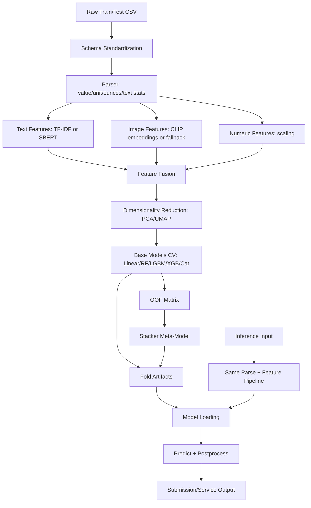

# Methodology, Workflow, and Model Improvement Report

## Project Context

This system is a multimodal product price prediction platform built from:

- textual product content,
- image signals,
- parsed numeric/structured features,

with SMAPE as the primary evaluation metric.

This report summarizes:

1. how the system is currently built,
2. end-to-end methodology and workflow,
3. implemented state-of-the-art (SoTA) components,
4. key improvement areas to improve model metrics.

---

## 1) Current Methodology (What We Are Building)

### 1.1 Problem Formulation

- Task: supervised regression for price prediction.
- Input modalities:
  - text (`catalog_content` → standardized to `Description` in runtime pipeline),
  - image links/paths (`image_link` → `image_path`),
  - parsed numerical cues (value/unit/ounces/text length).
- Target: `price` (standardized to `Price`).

### 1.2 Feature Methodology

Feature construction is orchestration-first (`FeatureBuilder`):

- **Text branch**: `TextEmbedder` using TF-IDF / SBERT modes.
- **Image branch**: `ImageEmbedder` with CLIP-like backend where available; robust zero-vector fallback where vision stack is unavailable.
- **Numeric branch**: `NumericBuilder` + `StandardScaler` on parsed numeric features.
- **Fusion**: sparse/dense stacking depending on text feature representation.

### 1.3 Modeling Methodology

- Base model families currently integrated:
  - Linear Regression,
  - Random Forest,
  - LightGBM,
  - optional XGBoost / CatBoost (environment dependent).
- Validation strategy: K-fold CV with out-of-fold predictions.
- Ensemble strategy: OOF-level stacking meta-learner (`Stacker`, Ridge/LGBM).

### 1.4 Inference Methodology

`PredictPipeline` handles:

1. parse + feature build,
2. optional dimensionality reducer transform,
3. fold model discovery and per-family averaging,
4. stacker prediction fallback to mean blend.

Postprocessing includes inverse transform (optional), clipping, rounding, and submission formatting.

---

## 2) End-to-End Workflow

### 2.1 Operational Workflow

1. Read raw CSV train/test.
2. Map schema to unified runtime columns.
3. Parse text into structured numeric signals.
4. Build multimodal features (text/image/numeric).
5. Reduce feature dimensionality (PCA/UMAP path depending on config).
6. Train CV base models and persist fold artifacts.
7. Build OOF matrix and optional stacker.
8. Run inference on holdout/test using persisted artifacts.
9. Save predictions, metrics, and reports.

### 2.2 Block Diagram

---

## 3) State-of-the-Art Components Implemented

### 3.1 SoTA Elements Present

- **Multimodal representation learning path** (text + image + structured numeric fusion).
- **Transformer-ready text branch** (SBERT/BERT class support in codebase).
- **CLIP-ready image branch** with robust fallback behavior.
- **Gradient boosting stack** (LGBM/XGB/Cat optional).
- **Stacked ensembling** via OOF meta-learning.
- **Config-driven orchestration** across train/inference.
- **Operational smoke-check instrumentation** with timing + complexity reporting.

### 3.2 Maturity Note

The architecture contains SoTA-capable components, but maturity differs by block:

- Stable and operational: parser, feature orchestrator, CV training loop, inference pipeline, baseline serving and CI gates.
- Partially environment-dependent: heavy vision/transformer paths (depends on local binary stack and package compatibility).
- Needs deeper production hardening: observability granularity, feature store parity automation, and model registry lifecycle automation.

---

## 4) Current Verified Operational State

From latest small-scale smoke validation (`20 train / 5 test`):

- End-to-end status: **PASS**
- Output row parity: **5/5**
- Timings (sec):
  - `load_train_sample`: 4.5427
  - `load_test_sample`: 2.9114
  - `sanity_parse_train`: 0.0154
  - `feature_build_only`: 0.0557
  - `dim_reduction_only`: 0.0425
  - `train_pipeline`: 0.3070
  - `inference_pipeline`: 0.1457

Interpretation: operational flow is healthy for small-batch check; timings are for system sanity, not throughput benchmarking.

---

## 5) Key Areas to Improve Metrics (SMAPE) — Prioritized

### P0: High-Impact / Low-Medium Effort

1. **Training-serving feature parity hardening**
   - Freeze feature schema and enforce parity tests.
   - Prevent silent drift in parsed feature availability.
   - Expected impact: reduces instability and leaderboard variance.

2. **Target transformation strategy optimization**
   - Controlled experiments with `log1p(price)` and robust inverse calibration.
   - Expected impact: better handling of heavy-tailed prices.

3. **Robust CV protocol upgrade**
   - Add repeated K-fold / stratified-by-price-bin CV.
   - Expected impact: lower variance and more reliable model selection.

4. **Model blend search**
   - Learn weighted blending over base models before/alongside stacker.
   - Expected impact: consistent SMAPE gains over uniform averaging.

### P1: High-Impact / Medium-High Effort

1. **Text representation upgrade**
   - Move from static TF-IDF to stronger sentence embeddings with domain adaptation and truncation strategy.
   - Expected impact: improved semantic pricing cues from catalog text.

2. **Image branch reliability + quality**
   - Stabilize CLIP runtime stack and add image quality filtering.
   - Expected impact: better use of visual pricing signals.

3. **Feature interactions and cross-modal signals**
   - Add engineered interactions (e.g., text length × parsed quantity, brand/entity cues).
   - Expected impact: incremental but compounding improvements.

4. **Hyperparameter optimization at system level**
   - Bayesian/Optuna sweeps for LGBM/XGB/Cat + stacker parameters.
   - Expected impact: strong lift once search space is cleanly defined.

### P2: Advanced / Research Track

1. **Two-stage architecture for difficult samples**
   - Stage 1 general model + Stage 2 specialist reranker on uncertain/high-error segments.
   - Expected impact: better tail performance and SMAPE reduction on hard cohorts.

2. **Error-driven curriculum retraining**
    - Mine high-residual samples and rebalance training batches.
    - Expected impact: improved generalization for outlier-rich pricing patterns.

3. **Semi-supervised and pseudo-labeling experiments**
    - Use confident predictions on unlabeled-like corpora for representation pretraining.
    - Expected impact: potentially large gains if label distribution shift exists.

---

## 6) Recommended 30-Day Metric Lift Plan

### Week 1

- Establish strict CV protocol and baseline reproducibility ledger.
- Lock schema contracts and add feature parity checks.

### Week 2

- Run systematic base model + blend sweeps (LGBM/XGB/Cat where available).
- Benchmark `raw target` vs `log1p target` variants.

### Week 3

- Upgrade text branch (stronger embedding configuration).
- Add interaction features and ablation matrix.

### Week 4

- Stabilize image branch runtime and rerun multimodal ablations.
- Finalize stacker and weighted blend for best CV robustness.

Deliverables:

- reproducible experiment table,
- ablation report per modality,
- promoted champion config with confidence interval.

---

## 7) Final Assessment

This project has a strong multimodal architecture and a credible SoTA-aligned methodology foundation.

The highest-value path to metric improvement is not adding random complexity, but disciplined protocol upgrades:

1. stronger feature parity,
2. robust CV and target handling,
3. tuned boosting + blend strategy,
4. stabilized high-capacity text/image branches.

With this plan, the system can move from operationally stable to significantly stronger metric performance while preserving engineering reliability.

